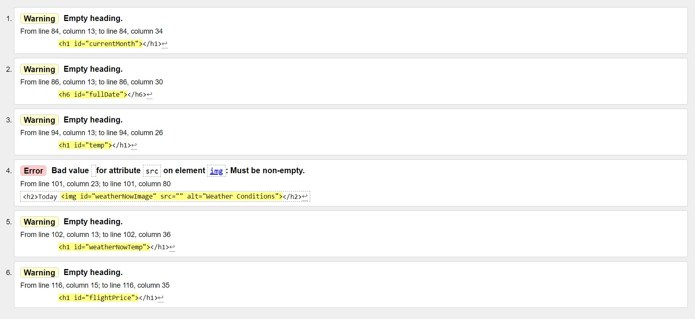
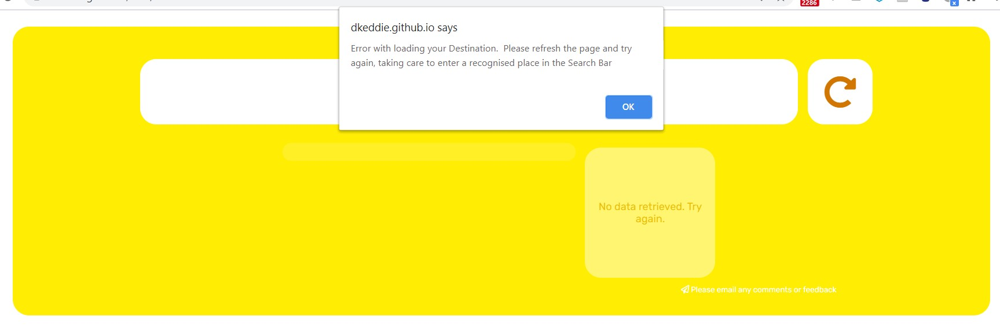
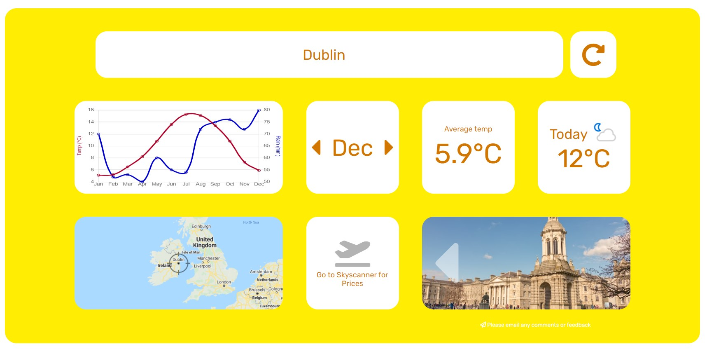
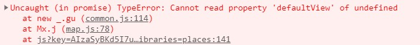
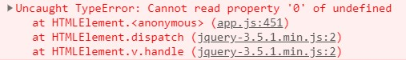

# **MILESTONE PROJECT TWO**

For Milestone Project Two, which requires the development of an interactive front-end site, users can may retrieve weather and other travel related information for a chosen destinations.

The website utilises APIs from various sources, sometimes sharing that data to retrieve data from other sources, and then presents the data in a simple UI based on a series of tiles.

The website can be viewed [here](https://dkeddie.github.io/MS2/)

## **UX**

### **Who is the Website for?**

The user of the site will be a prospective traveller looking to determine a suitable travel destination.  
 

### **User Stories**

As a user, I want to be able to see the likely weather of a chosen destination to help me decide if it is the correct decision.

 **Item** | **Experience** | **Objectives**
---------|----------------|---------------
1 | As a user, I want to be able to find a possible travel destination | Provide a search field to retrieve information on destinations
2 | As a user, I want to be able check the location of the travel destination | Provide a visual map reference to determine the location of the destination chosen
3 | As a user of the site, I want to be able to see typical weather conditions of that destination | Provide the typical temperature for each month of the year
4 | As a user, I want to be able to determine the best months to visit the destination | Provide users with a chart of the weather showing the typical temperature and rainfall over a year
5 | As a user, I want to see the current weather in the chosen destination | Provide the current temperature and conditions for the chosen destination
6 | As a user, I would like to find out the cost of travelling to this destination | Provide the cost of a flight to the destination.
7 | As a user, I would like to see what the place I would like to visit looks like | Provide images of the destination
 

### **Functions of the Website**

The functions of the website are to:-    
    
1. Provide weather information for travel destinations around the world.
    - Users can see the average temperatures and rainfall for each month across a 12 month period.  This weather a retrieved from the Meteostat API which provides historic, average weather data, and presented in a Chart.js graph.
    - Users can also scroll through the months and see the Average Temperative of the selected month.  This is the same information provided the Meteostat API.
    - Users can also see the current weather of the destination.  This information is provided from Weatherapi.com.

2.  Retrieve flight prices for those destinations from the users current location.

    - As the intention of the site is to determine the best months to travel to a particular destination, this information will provide the lowest price from which flights start from to the destination in that particular month.  This information is provided from the Skycanner.net API.

3. Show users where in the world the selected destination is located.

    - Users can see where in the world the selected destination is located.  This is provided by the Google Maps API.

4. Retrieve images of 'Places of Interest' of the selected destination.

    - Provide a selection of images which may by Points of Interest for visitors to the chosen destination.  This is provided by Google Places by means of the Google Maps Javascript API.  
 

___
 

## **Design**

### **Mobile v. Desktop**

By designing the web app around a tile system, the intention is that the app will work on any screen size by adjusting the number of tiles per row.  The tiles are a fixed size, and wrap as required to suit the screen resolution.  As such, the page is fully responsive.  
 

### **Key concepts**
The primary purpose of the web app is simply to provide weather data for chosen destinations.  As such, the intention of the user interface is to be simple and uncluttered so that it does not detract from this information, albeit supplementary tiles may make the web app more useful.  

As such, the page is developed along certain principles:-

  1. Not to provide multiple pages that might detract from this core set of information;
  2. Additional functionality and more detailed information may be added to the web app in time through the Tiles (see **Features to Implement in the Future** below).  
 

### **Wireframe**

Figma was used to develop a key concept into framework for developing the web page / app.  Only a desktop framework was formulated at this stage.

A copy of the original wireframe can be found here: [Figma](https://www.figma.com/file/3Yqx3U9HCWVm7PZprEhVEt/MS2?node-id=0%3A1) or [PDF](README-attachments/Wireframe.pdf)

The PDF contains additional explanation on the intention of each Tile.

Whilst my wireframe did not incorporate the footer, I knew that I would likely want to add this at a later point.  The contents would be minimal and yet to be decided, as it would be subsidiary to the other information provided.  
 

### Typography

The [Rubik](https://fonts.google.com/specimen/Rubik) font (from Google Fonts) is the only font used throughout the whole website with Sans Serif as the fallback font in case for any reason the font isn't being imported into the site correctly. 

Rubik was selected as a super-clean, legible front that display clearly on the Tiles.  
 

### Imagery

Imagery is limited to the Photo tile.  The imagery is sourced from Google Places via the Maps Javascript API (as opposed to the Places API, which places restrictions on search without upgrading to the paid version and also does not function with Javascript API retrieval methods due to header conflicts).  
 

___

## Features

### Responsive

The site is suitable for mobile through desktop displays.
https://fonts.google.com/specimen/Rubik

### Interactive Elements

The web page is interactive in the following ways:-

* Three steps to fully load the page with user inputs.  The page transitions between each:-
  1. Current Location (initial):  User inputs their current location.  Confirming the current location transitions the input field away and the destination field appears.
  2. Destination: User inputs their chosen destination.  Confirming the destination transitions the page to load the Tiles.
  3. Tiles (Full Page Load): The page loads information to the Tiles based on the current location and destination inputs.

* Month Tile - the tile will load on the current month.  The months can be changed back and forth and this affects two other tiles:-
  1. Average Temperature - the average temperature for each month will be shown to match the corresponding month.
  2. Flight Prices - the lowest price to the destination will be shown for the month shown .(if one can be retrieved from the API)

* Photo Tile - photos displaying Points of Interest can be changed by clicking forward/back.

* The interactive elements can be seen below:-  

### Existing Features  

The following features load on the page after inputting the Current Location and Destination:-

* **Weather Chart Tile**: average temperatures and rainfall for the destination selected for a 12 month period

* **Month Tile**: controls the month for the tiles that are 'month specific'  

* **Average Temperature Tile**: displays the average temperate (and high / low) for the month selected  

* **Current Weather Tile**: displays the current weather conditions in the destination  

* **Map Tile**: shows the location of the destination selected  

* **Flight Price Tile**: shows the lowest price for a flight to the destination (if available) and by clicking, takes users to Skyscanner.net  

* **Photo Tile**: displays a selection of images (points of interest) of the destination  

### Features to Implement in the Future

In the future, I will give consideration to implementing the following features to enhance the user experience and functionality of the site:-

* **Weather Tiles - Celsius / Farhenheight:** Option to switch between Celsius and Farhenheit.
* **Map Tile - Current Location and Travel Time:** On-click, the tile will enlarge to show Current Location and Destination, and estimated travel time to the destination.
* **Flight Price Tile - Currency selection:** Option to switch between currencies.
* **Flight Price Tile - Improve functionality to deliver prices:** With further refinement, and possibly use of the full Skyscanner API (currently only accessed through RapidAPI), this could be improved.  Steps to be explored:-
  1. Searching for local airports and returning results based on that parameter, rather than the current place parameter.
  2. Providing option to select the preferred airport.  Particularly for the current location, and in places with more than one airport (e.g. London), this could provide more tailored results for the user.
* **Photo Tile - Improve photos returned:** The current API is a free Google facility, but the quality of pictures returned is not great.  In order to get better quality pictures of destinations, then a paid for API would have to integrated into the site.
* **Photo Tile - Enlarge Images with details:** On-click, the images will enlarge and provide details of the image (e.g. attraction name).

 

## Technologies Used

### Languages Used

* [HTML5](https://en.wikipedia.org/wiki/HTML5)
* [CSS](https://en.wikipedia.org/wiki/Cascading_Style_Sheets) 

### Frameworks, Libraries and Programmes Used 

* [Bootstrap 4](https://getbootstrap.com/)  
Bootstrap is generally used to assist with the responsiveness and layout of the website.  By utilising the 'flex-wrap' feature, the Tiles on the page adjust from a desktop screen configuration of 5 squares wide x 2 squares high to an appropriate width and height to suit the device resolution settings.

* [Google fonts](https://fonts.google.com/)  
Google fonts is used to import the 'Rubik' font into the style.css file which is used throughout the project.

* [Chart.js](https://www.chartjs.org/)  
Chart.js is used to display the monthly average temperatures and rainfalls.

* [Google Maps Static API](https://developers.google.com/maps/documentation/maps-static/overview)  
A static map was used for the Map Tile in order to provide users with a visual reference of where their destination is located.

* [Google Maps Javascript API](https://developers.google.com/maps/documentation/javascript/overview) 
The Javascript API was used for its access to the Google Places library in order to return access to images of the destination.  

* [jQuery, incl UI](https://jquery.com/)  
jQuery is used for Javascript DOM manipulation.  The UI 
is also library is also for effects to enable smooth transitions for the Tiles.

* [Git](https://git-scm.com/)  
Git was used for version control by utilizing the Gitpod terminal to commit to Git and Push to GitHub.

* [GitHub](https://github.com/)  
GitHub is used to store the projects code after being pushed from Git.

* [Figma](https://www.figma.com/)  
Figma was used to create the wireframes during the design process.

* [Kapwing](https://www.kapwing.com/)
Kapwing used for editing videos and creating GIFs used in this README file.

* [Screen Recorder](https://chrome.google.com/webstore/detail/screen-recorder/hniebljpgcogalllopnjokppmgbhaden)  
Screen Recorder used for creating videos (edited in Kapwing) of website features in operation.

## Testing

### User Story Feedback and Testing

**1** | **As a user, I want to be able to find a possible travel destination**
---------|----------------
(a) | Users can load destinations into the search bar to select destinations.  
(b) | The search bar is restricted to towns and cities, so the search bar can be specific and not over-loaded with the likes of street names.
(c) | 
________________

 

**2** | **As a user, I want to be able check the location of the travel destination**
---------|----------------
(a) | In order for users to be able to confirm that the correct destination has been selected, a map is included on the panel.
(b) | A cross-hair indicates the location of the destination selected.
(c) | Users can see the country, and surrounding countries, of the destination selected.
(d) | 
_____________

 

**3** | **As a user of the site, I want to be able to see typical weather conditions of that destination**
---------|----------------
**4** | **As a user, I want to be able to determine the best months to visit the destination**
(a) | Once the destination is loaded, the panel displays two past trends of weather for that place, the average temperature and rainfall for each month in the form of a Line Chart.
(b) | The Chart will show the warmest and driest months to visit a destination, two factors which help to determine the best months to visit a destination.
(c) | To see the average temperature of each month, scroll through the months to read the temperature in degrees Celsius.
(d) |
_____________

 

**5** | **As a user, I want to see the current weather in the chosen destination**
---------|----------------
(a) | A Current Weather tile is included on the page.
(b) | 
_____________

 

**6** | **As a user, I would like to find out the cost of travelling to this destination**
---------|----------------
(a) | A flight price tile is included on the page.
(b) | 
(c) | The price of the flight of is the lowest price returned from Skyscanner for the destination.
(d) | The price is based on the current month selected
(e) | 
(f) | Users can click on the Flight Price Tile to go to Skyscanner and search flight prices in more detail
(g) | 
(h) | Where it is not possible to return flight prices, users can still click on the Flight Price Tile to direct them to Skyscanner.net.
(i) | 
_____________

 

**7** | **As a user, I would like to see what the place I want like to visit looks like** 
---------|----------------
(a) | The Photo Tile shows a selection of photos that are 'Points of Interest' at the destination.  
(b) |  
____________

 

### Validators

The W3C Markup Validator and W3C CSS Validator Services were used to validate every page of the project to ensure there were no syntax errors in the project.

**[W3C Markup Validator](https://validator.w3.org/) - [Results](https://validator.w3.org/nu/?doc=https%3A%2F%2Fdkeddie.github.io%2FMS2%2F)**

The following errors are raised on the validator:-

  

These errors are associated with the blank headings / fields which will be populated once the Javascript app has run, following the input of the user information and full load of the page.  
As such, these Errors will be rectified once the page has fully loaded.

 

**[W3C CSS Validator](https://jigsaw.w3.org/css-validator/) - [Results](https://jigsaw.w3.org/css-validator/validator?uri=https%3A%2F%2Fdkeddie.github.io%2FMS2%2Fassets%2Fcss%2Fstyle.css&profile=css3svg&usermedium=all&warning=1&vextwarning=&lang=en)**

There are no errors found on the validation service for CSS.

### Javascript Code Quality - JSHint

[JSHint](https://jshint.com/) has been used to check and test the Code Quality of the Javascript used on this page.  The Javascript has been updated in line with warnings initially returned.  The following items remain and which are deemed not critical to the functioning of the site:-

- Where warnings of ES6, 8 and 10 have been raised, these have not been ignored, as the main browsers will function with the use of this version of Javascript.
- There remains one warning, 'Redefinition of 'origin'', hover this is an intended part of the Javascript to be implemented on the page.
- Undefined variables - these are undefined on the initial page load but become defined after further Javascript has been implemented.
- Unused variables - these variables are required for the running of external APIs.
 
 

### Manual Testing of the Site

The following tests were carried out to ensure functionality before deployment:-

**Test**: Check that page fully loads with different Current Locations and Destinations
* Steps followed:  
  * Static Current Location of Dublin for 10 different Destinations tested
  * 10 different Current Locations with static Destination of Dublin tested
  * 10 different locations used were:-  
    * New York
    * Shanghai
    * Milan  
    * London
    * Abu Dhabi
    * Los Cristianos
    * Florence
    * Perth
    * Wellington
    * Cape Town
  * Check that all Tiles load
  * Check that map shows correct Destination
  * Check that Months Tile rotates when clicked, and Ave Temp and Flight Price changes
  * Check that images can be rotated on Photos Tile
* Results:  Page loads in all scenarios but the following limitations are sometimes observed when carrying out the full test  
    * Flight Prices may not always be returned.  That can be for a number of reasons, including:-  
        1. The place name returned by Algolia is not recognised by Skyscanner.net.  For example, London is called City of London in Algolia and is therefore not recognised by Skyscanner.  
        2. Requests to Skyscanner API may be exceeded if used too much or to quickly.  This is a limitation of the open API available.  
        3. There may be no Flights available in that month.  

        A Catch statement has been put in place for when the above 3 items occur, so that Users are directed to Skyscanner.net to be able to check prices manually.  The Tile may also toggle as appropriate when rotating through the months to show prices.
    * **[Bug now fixed]** *Some city or town names may be the same in different countries, e.g. Perth.  The web page defaults only to the top selection, Perth, WA.  This is a current bug which will need to be rectified.* **[Bug now fixed]**

**Test**: Test the page with invalid inputs
* Steps followed:-
  1. Current Location of 'Dublin' and Destination of 'Asdfasdfasdf' used to test page.
  2. Current Location of 'Asdfasdfasdf' and Destination of 'Dublin' used to test page.
  3.  Destination and Current Location of 'Asdfasdfasdf' used to test page.
* Results:-
  * Steps 1 and 3 return expected Error alert.
  
  * The page loads under Step 2, however this is to be expected as the Current Location is only required for the Flight Price Tile, which has an option if no prices are returned from the API
  

During the on-going testing and development of the site, bugs were discovered and resolved.  These can be reviewed in the list of Git commits, specifically those with the 'fix' prefix.

For a list of the Git Commit history, this can be viewed [here](https://github.com/dkeddie/MS2/commits/master)

### Further Testing

During the development of the website, and again as a final, comprehensive and in-depth review, the following testing was carried out:-

* The Website was tested on Google Chrome, Internet Explorer, Microsoft Edge and Safari browsers.
* The website was viewed on a variety of devices: Desktop, Laptop, iPhone 8 & iPhoneX.
* Buttons were checked to ensure when hovered or active that they are responsive and operate uniformly.

### Known Bugs

The following issues were identified during development of the site.  Some of them have been fixed during the final checking, testing and deployment phase:-

1. The following error occurs in the console when both the Current Location and Destination have been inputted, and the Tiles are loaded:-  

No known negative effect has been detected.
2. The following error can occur at times in the console when rotating through the images in the Photo Tile:-  

Although the image does not change when the Error arises, the images will continue to rotate when the forward/back options are selected.  
**[Bug now fixed]** *This error has now been resolved by creating a new array which only contains places with photos, excluding those items which do not contain photos from the original API array* **[Bug now fixed]**
3. A city or town with the same name in different locations will only return information on the top return.  For example, Perth will only return Perth, WA.  
**[Bug now fixed]** *This fault has now been resolved by modifying the Algolia API.  The global variables now set according to the full place name and country as opposed to just the city name, which rectifies this issue.* **[Bug now fixed]**

## Deployment

The website has been deployed on GitHub and is currently publicly accessible. 

The development of the website has been undertaken on Gitpod.

The steps from start to present were:-

1. Creation of repository on GitHub, utilising Code Institute template.

2. Launch of repository on Gitpod.

3. Utilise Git to push content back to GitHub.  This was undertaken at regular intervals throughout the development of the website.

4. Deployment of the webpage was implemented by
    * Going to the 'Settings' of the repository,
    * Scrolling to 'GitHub Pages' section,
    * Selecting 'master branch' of the Source dropdown menu
        
The website is now deployed and can be viewed at:
    [https://dkeddie.github.io/MS2/](https://https://dkeddie.github.io/MS2/)

## Deployment of a Clone

Should you wish to deploy your own version of the website, the following steps may be followed to host your own version on GitHub:-

1. Visit my GitHub Repository: [MS2](https://github.com/dkeddie/MS2)

2. Click dropdown 'Code' and copy url to 'Clone with HTTPS'  

3. Select 'Import Repository' from the Menu dropdown, paste the url, give your new repository a name and click 'Begin Import'

4. Go to your new Repository.  You may chose to launch the repository in an IDE of your chosing in order to make changes to the website, and customise it to your requirements.

5. To deploy the website, follow step 4 of the **Deployment** section immediately above.

## Credits

### Content

All content and code was written by the developer, except where taken from libraries or documented within this file or the Code files.

### Media

The Media Content utilised for this site is taken from Google Places via the Google Maps Javascript API, which is available for public use.

### Acknowledgements

Thank you to my mentor for feedback and advice given throughout the project.
