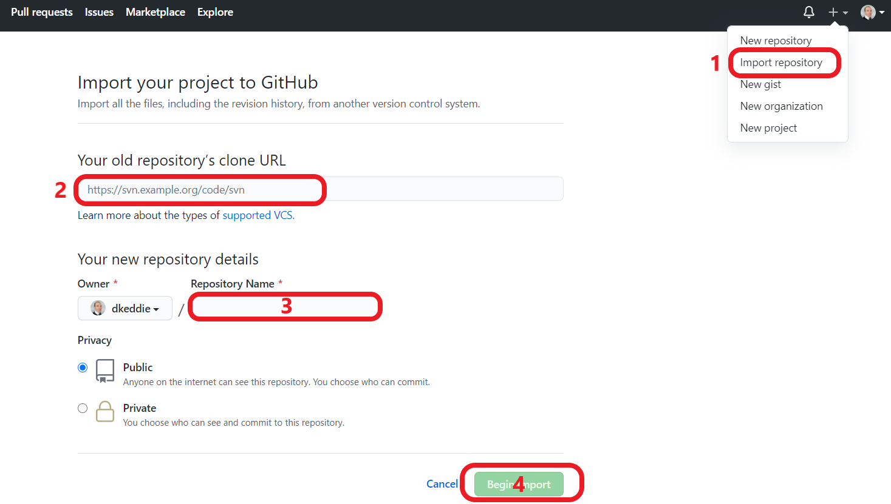

# **MILESTONE PROJECT TWO**

For Milestone Project Two, which requires the development of an interactive front-end site, users can may retrieve weather and other travel related information for a chosen destinations.

The website utilises APIs from various sources, sometimes sharing that data to retrive data from other sources, and then presents the data in a simple UI based on a series of tiles.

The website can be viewed [here](https://dkeddie.github.io/MS2/)

## **UX**

### **Who is the Website for?**

The user of the site will be a prospective traveller looking to determine a suitable travel destination.  
 

### **User Stories**

*As a user, I want to be able to see the likely weather of a chosen destination to help me decide if it is the correct decision.

 **Item** | **Experience** | **Objectives**
---------|----------------|---------------
1 | As a user, I want to be able to find a possible travel destination | Provide a search field to retrieve information on destinations
2 | As a user, I want to be able check the location of the travel destination | Provide a visual map reference to determine the location of the destination chosen
3 | As a user of the site, I want to be able to see typical weather conditions of that destination | Provide the typical tempoerative temperature for each month of the year
4 | As a user, I want to be able to determine the best months to visit the destination | Provide users with a chart of the weather showing the typical temperature and rainfall over a year
5 | As a user, I want to see the current weather in the chosen destination | Provide the current temperature and conditions for the chosen destination
6 | As a user, I would like to find out the cost of travelling to this destination | Provide the cost of a flight to the destination.
7 | As a user, I would like to see what the place I would like to visit looks like | Provide images of the destination
 

### **Functions of the Website**

The functions of the website are to:-    
    
1. Provide weather information for travel destinations around the world.
    - Users can see the average temperares and rainfall for each month across a 12 month period.  This weather a retrieved from the Meteostat API which provides historic, average weather data, and presented in a Chart.js graph.
    - Users can also scroll through the months and see the Average Temperative of the selected month.  This is the same information provided the Meteostat API.
    - Users can also see the current weather of the destination.  This information is provided from Weatherapi.com.

2.  Retrieve flight prices for those destinations from the users current location.

    - As the intention of the site is to determine the best months to travel to a particular destination, this information will provide the price from which flights start from to the destination in that particular month.  This information is provided from the Skycanner.net API.

3. Show users where in the world the selected destination is located.

    - Users can see where in the world the selected destination is located.  This is provided by the Google Maps API.

4. Retrieve images of 'Places of Interest' of the selected destination.

    - Provide a selection of images which may by Points of Interest for visitors to the chosen destination.  This is provided by Google Places by means of the Google Maps Javascript API.  
 

___
 

## **Design**

### **Mobile v. Desktop**

By designing the web app around a tile system, the intention is that the app will work on any screen size by adjusting the number of tiles per row.  The tiles are a fixed size, and wrap as required to suit the screen resolution.  As such, the page is fully responsive.  
 

### **Key concepts**
The primary purpose of the web app is simply to provide weather data for chosen destinations.  As such, the intention of the user interface is to be simple and uncluttered so that it does not detract from this information, albeit supplementary tiles may make the web app more useful.  

As such, the page is developed along certain principles:-

  1. Not to provide multiple pages that might detract from this core set of information;
  2. Additional functionality and more detailed information may be added to the web app in time through the Tiles (see **Features to Implement in the Future** below)  
 

### **Wireframe**

Figma was used to develop a key concept into framework for developing the web page / app.  Only a desktop framework was formulated at this stage.

A copy of the original wireframe can be found here: [Figma](https://www.figma.com/file/3Yqx3U9HCWVm7PZprEhVEt/MS2?node-id=0%3A1) or [PDF](README-attachments/Wireframe.pdf)

The PDF contains additional explanation on the intention of each Tile.

Whilst my wireframe did not incoproate the footer, I knew that I would likely want to add this at a later point.  The contents would be minimal and yet to be decided, as the would be subsidiary to the other information provided.

### **Colours**

+++++++++++++++++

The colour pallette can be viewed [HERE](http://paletton.com/#uid=c0w3k0Z3N0k6hjd2BtG4vnW82ekcH9w)

++++++++++++++++

### Typography

The Rubik font is the only font used throughout the whole website with Sans Serif as the fallback font in case for any reason the font isn't being imported into the site correctly. 

Rubik was selected as a super-clean, legibile front that display clearly on the Tiles.  
 

### Imagery

Imagery is limited to the Photo tile.  The imagery is sourced from Google Places via the Maps Javascript API (as opposed to the Places API, which places restrictions on search without upgrading to the paid version and also does not function with Javascript API retrieval methods due to header conflicts).  
 

___

## Features

### Responsive

* Site is suitable for mobile through desktop displays.
* +++++++++++++++=

### Interactive Elements

* ++++++++++++++

### Existing Features  

### Features to Implement in the Future

++++++++++++++++

## Technologies Used

### Languages Used

* [HTML5](https://en.wikipedia.org/wiki/HTML5)
* [CSS](https://en.wikipedia.org/wiki/Cascading_Style_Sheets) 

### Frameworks, Libraries and Programmes Used 

* [Bootstrap 4](https://getbootstrap.com/)  
Bootstrap is generally used to assist with the responsiveness and layout of the website.  By utilising the 'flex-wrap' feature, the Tiles on the page adjust from a desktop screen configuration of 5 squares wide x 2 squares high to an appropriate width and height to suit the device resolution settings.

* [Google fonts](https://fonts.google.com/)  
Google fonts is used to import the 'Rubik' font into the style.css file which is used throughout the project.

* [Chart.js](https://www.chartjs.org/)  
Chart.js is used to display the monthly average temperatures and rainfalls.

* [Google Maps Static API](https://developers.google.com/maps/documentation/maps-static/overview)  
A static map was used for the Map Tile in order to provide users with a visual reference of where their destination is located.

* [Google Maps Javascript API](https://developers.google.com/maps/documentation/javascript/overview) 
The Javascript API was used for its access to the Google Places library in order to return access to images of the destination.  

* [jQuery, incl UI](https://jquery.com/)  
jQuery is used for javascript DOM manipulation.  The UI 
is also library is also for effects to enable smooth transitions for the Tiles.

* [Git](https://git-scm.com/)  
Git was used for version control by utilizing the Gitpod terminal to commit to Git and Push to GitHub.

* [GitHub](https://github.com/)  
GitHub is used to store the projects code after being pushed from Git.

* [Figma](https://www.figma.com/)  
Figma was used to create the wireframes during the design process.

* [Kapwing](https://www.kapwing.com/)
Kapwing used for editing videos and creating GIFs used in this README file.

* [Screen Recorder](https://chrome.google.com/webstore/detail/screen-recorder/hniebljpgcogalllopnjokppmgbhaden)  
Screen Recorder used for creating videos (edited in Kapwing) of website features in operation.

## Testing

### User Story Feedback and Testing

++++++++++++++++

### Validators

The W3C Markup Validator and W3C CSS Validator Services were used to validate every page of the project to ensure there were no syntax errors in the project.

* [W3C Markup Validator](https://validator.w3.org/)

    Results:-
    * [Overview](+++++++++++)

* [W3C CSS Validator](https://jigsaw.w3.org/css-validator/) - [Results](+++++++++++++++++)

There are no errors found on the validation service.

### Manual Testing of the Site

The following tests were carried out to ensure functionality before deployment:-

**Test**: Check that website links are functioning (Nav bar)  
* Steps followed:  
  * Clicked first link (Overview) in the Navbar;
  * Checked correct destination/page loads;
  * Pressed 'Back' to return to page under test;
  * Proceeded to next link and followed above steps until all links tested.
  * Proceeded to next page and followed the above steps until all pages tested.
* Results:  All links were functioning.

### Further Testing

During the development of the website, and again as a final, comprehensive and in-depth review, the following testing was carried out:-

* The Website was tested on Google Chrome, Internet Explorer, Microsoft Edge and Safari browsers.
* The website was viewed on a variety of devices: Desktop, Laptop, iPhone 8 & iPhoneX.
* Buttons were checked to ensure when hovered or active that they are responsive and operate uniformly.

### Known Bugs

The following issues were identified during development of the site:-

* 

## Deployment

The website has been deployed on GitHub and is currently publicly accessible. 

The development of the website has been undertaken on Gitpod.

The steps from start to present were:-

1. Creation of repository on GitHub, utilising Code Institute template.

2. Launch of repository on Gitpod.

3. Utilise Git to push content back to GitHub.  This was undertaken at regular intervals throughout the development of the website.

4. Deployment of the webpage was implemented by
    * Going to the 'Settings' of the repository,
    * Scrolling to 'GitHub Pages' section,
    * Selecting 'master branch' of the Source dropdown menu
        
The website is now deployed and can be viewed at:
    [https://++++++++++](https://+++++++++++)

## Deployment of a Clone

Should you wish to deploy your own version of the website, the following steps may be followed to host your own version on GitHub:-

1. Visit my GitHub Repository: [++++++](https://github.com/dkeddie/++++++++++)

2. Click dropdown 'Code' and copy url to 'Clone with HTTPS'  

3. Select 'Import Repository' from the Menu dropdown, paste the url, give your new repository a name and click 'Begin Import'

4. Go to your new Repository.  You may chose to launch the repository in an IDE of your chosing in order to make changes to the website, and customise it to your requirements.

5. To deploy the website, follow step 4 of the **Deployment** section immediately above.

## Credits

### Content

All content was written by the developer.

### Media

++++++

### Acknowledgements

Thank yous to:-

*  My mentor for feedback and advice given throughout the project.

*  Fellow Code Institute students who gave feedback as part of Peer Review:-
