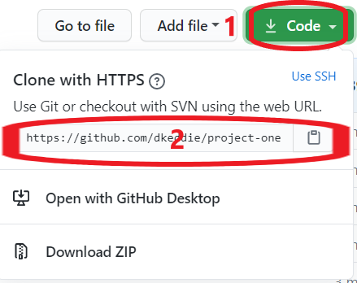

# **MILESTONE PROJECT TWO**

For Milestone Project Two, which requires the development of an interactive front-end site, users can may retrieve weather and other travel related information for a chosen destinations.

The website utilises APIs from various sources, sometimes sharing that data to retrive data from other sources, and then presents the data in a simple UI based on a series of tiles.

The website can be viewed [here](https://dkeddie.github.io/MS2/)

## **UX**

### **Who is the Website for?**

The user of the site will be a prospective traveller looking to determine a suitable travel destination.  

### **User Stories**

*As a user, I want to be able to see the likely weather of a chosen destination to help me decide if it is the correct decision.

 **Item** | **Experience** | **Objectives**
---------|----------------|---------------
1 | As a user, I want to be able to find a possible travel destination | Provide a search field to retrieve information on destinations
2 | As a user, I want to be able check the location of the travel destination | Provide a visual map reference to determine the location of the destination chosen
3 | As a user of the site, I want to be able to see typical weather conditions of that destination | Provide the typical tempoerative temperature for each month of the year
4 | As a user, I want to be able to determine the best months to visit the destination | Provide users with a chart of the weather showing the typical temperature and rainfall over a year
5 | As a user, I want to see the current weather in the chosen destination | Provide the current temperature and conditions for the chosen destination
6 | As a user, I would like to find out the cost of travelling to this destination | Provide the cost of a flight to the destination.
7 | As a user, I would like to see what the place I would like to visit looks like | Provide images of the destination

### **Functions of the Website**

The functions of the website are to:-

1. +++++++++++++++++++

## **Design**

### **Mobile v. Desktop**

++++++++++++++++++

### **Key concepts**

*+++++++++++++++++++

### **Wireframe**

Use of Figma to develop key concepts into framework to commence web development.  Two pages were worked up, for desktop and mobile, in the knowledge that the basic page design would be replicated across the pages.

A copy of the original wireframe can be found here: [Figma](https://www.figma.com/file/rbTyJlZNq6apXDVEMjG21f/Project-1?node-id=12%3A0) or [PDF](README-attachments/Wireframe.pdf)

Whilst my wireframe did not incoproate the footer, I knew that I would likely want to add this at a later point.  The contents would be minimal and yet to be decided, as the would be subsidiary to the other information provided.

### **Colours**

+++++++++++++++++

The colour pallette can be viewed [HERE](http://paletton.com/#uid=c0w3k0Z3N0k6hjd2BtG4vnW82ekcH9w)

++++++++++++++++

### Typography

The Montserrat font is the main font used throughout the whole website with Sans Serif as the fallback font in case for any reason the font isn't being imported into the site correctly. Montserrat is a clean font used frequently in programming, so it is both attractive and appropriate.

Whilst acknowledged that this font has been used frequently in the Code Institute course to date, after experimenting with a few other fonts, I still felt that it is the most appropriate font to use for this project for the reasons noted.

### Imagery

As the website is meant to be functional, there is no background images and limited background colours utilised to maintain a clear, crisp display that is functional and distraction-free for users.  Whilst images are of course important to provide context and understanding to a user, they are limited to the gallery (images of the Park and the projects) and corporate logos.

## Features

### Responsive

* Site is suitable for mobile through desktop displays.
* +++++++++++++++=

### Interactive Elements

* ++++++++++++++

### Existing Features  

### Features to Implement in the Future

++++++++++++++++

## Technologies Used

### Languages Used

* [HTML5](https://en.wikipedia.org/wiki/HTML5)
* [CSS](https://en.wikipedia.org/wiki/Cascading_Style_Sheets) 

### Frameworks, Libraries and Programmes Used 

* [Bootstrap 4](https://getbootstrap.com/)  
Bootstrap was generally used to assist with the responsiveness and styling of the website.  Components which were utilised were:-
  * [Buttons](https://getbootstrap.com/docs/4.5/components/buttons/)
  * [Carousel](https://getbootstrap.com/docs/4.5/components/carousel/)
  * [Collapse](https://getbootstrap.com/docs/4.5/components/collapse/)
  * [Dropdowns](https://getbootstrap.com/docs/4.0/components/dropdowns/)
  * [Modal](https://getbootstrap.com/docs/4.5/components/modal/) 

* [Google fonts](https://fonts.google.com/)  
Google fonts were used to import the 'Monserrat' font into the style.css file which is used on all pages throughout the project.

* [Chart.jx](+++++++++++++++)  

* [Google Maps Javascript API](https://developers.google.com/maps/documentation/javascript/overview) including [Styling Wizard](https://mapstyle.withgoogle.com/)  
Google Maps was used in the footer to provide locations for the Projects.  Functionaly of the maps was limited in terms of zoom, map type and points of interest to maintain a simple viewport of the Park and Project locations only.  

* [jQuery](https://jquery.com/)  
jQuery came with Bootstrap to make some of the components operate in JavaScript.

* [Git](https://git-scm.com/)  
Git was used for version control by utilizing the Gitpod terminal to commit to Git and Push to GitHub.

* [GitHub](https://github.com/)  
GitHub is used to store the projects code after being pushed from Git.

* [Figma](https://www.figma.com/)  
Figma was used to create the wireframes during the design process.

* [Paletton](https://paletton.com/)  
Paletton was used to create a pallette of colours that supported the main colour of the website, which is based on one of the company logos.

* [Kapwing](https://www.kapwing.com/)
Kapwing used for editing videos and creating GIFs used in this README file.

* [Screen Recorder](https://chrome.google.com/webstore/detail/screen-recorder/hniebljpgcogalllopnjokppmgbhaden)  
Screen Recorder used for creating videos (edited in Kapwing) of website features in operation.

## Testing

### User Story Feedback and Testing

++++++++++++++++

### Validators

The W3C Markup Validator and W3C CSS Validator Services were used to validate every page of the project to ensure there were no syntax errors in the project.

* [W3C Markup Validator](https://validator.w3.org/)

    Results:-
    * [Overview](+++++++++++)

* [W3C CSS Validator](https://jigsaw.w3.org/css-validator/) - [Results](+++++++++++++++++)

There are no errors found on the validation service.

### Manual Testing of the Site

The following tests were carried out to ensure functionality before deployment:-

**Test**: Check that website links are functioning (Nav bar)  
* Steps followed:  
  * Clicked first link (Overview) in the Navbar;
  * Checked correct destination/page loads;
  * Pressed 'Back' to return to page under test;
  * Proceeded to next link and followed above steps until all links tested.
  * Proceeded to next page and followed the above steps until all pages tested.
* Results:  All links were functioning.

### Further Testing

During the development of the website, and again as a final, comprehensive and in-depth review, the following testing was carried out:-

* The Website was tested on Google Chrome, Internet Explorer, Microsoft Edge and Safari browsers.
* The website was viewed on a variety of devices: Desktop, Laptop, iPhone 8 & iPhoneX.
* Buttons were checked to ensure when hovered or active that they are responsive and operate uniformly.

### Known Bugs

The following issues were identified during development of the site:-

* 

## Deployment

The website has been deployed on GitHub and is currently publicly accessible. 

The development of the website has been undertaken on Gitpod.

The steps from start to present were:-

1. Creation of repository on GitHub, utilising Code Institute template.

2. Launch of repository on Gitpod.

3. Utilise Git to push content back to GitHub.  This was undertaken at regular intervals throughout the development of the website.

4. Deployment of the webpage was implemented by
    * Going to the 'Settings' of the repository,
    * Scrolling to 'GitHub Pages' section,
    * Selecting 'master branch' of the Source dropdown menu
        
The website is now deployed and can be viewed at:
    [https://++++++++++](https://+++++++++++)

## Deployment of a Clone

Should you wish to deploy your own version of the website, the following steps may be followed to host your own version on GitHub:-

1. Visit my GitHub Repository: [++++++](https://github.com/dkeddie/++++++++++)

2. Click dropdown 'Code' and copy url to 'Clone with HTTPS'  

3. Select 'Import Repository' from the Menu dropdown, paste the url, give your new repository a name and click 'Begin Import'

4. Go to your new Repository.  You may chose to launch the repository in an IDE of your chosing in order to make changes to the website, and customise it to your requirements.

5. To deploy the website, follow step 4 of the **Deployment** section immediately above.

## Credits

### Content

All content was written by the developer.

### Media

++++++

### Acknowledgements

Thank yous to:-

*  My mentor for feedback and advice given throughout the project.

*  Fellow Code Institute students who gave feedback as part of Peer Review:-
